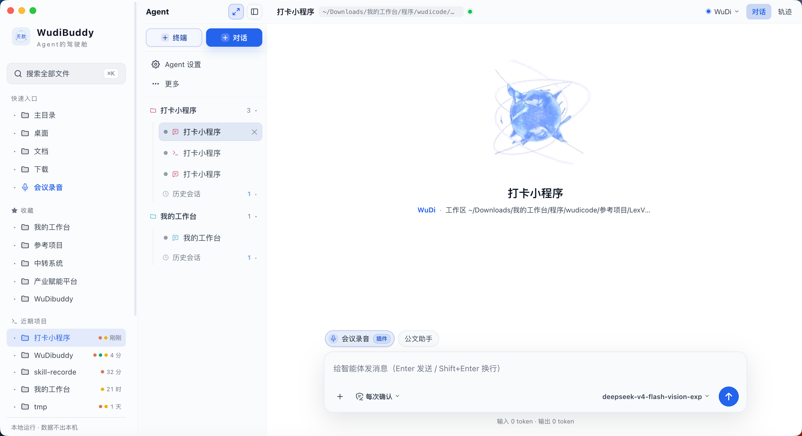
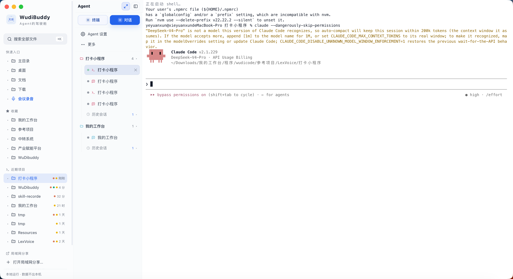
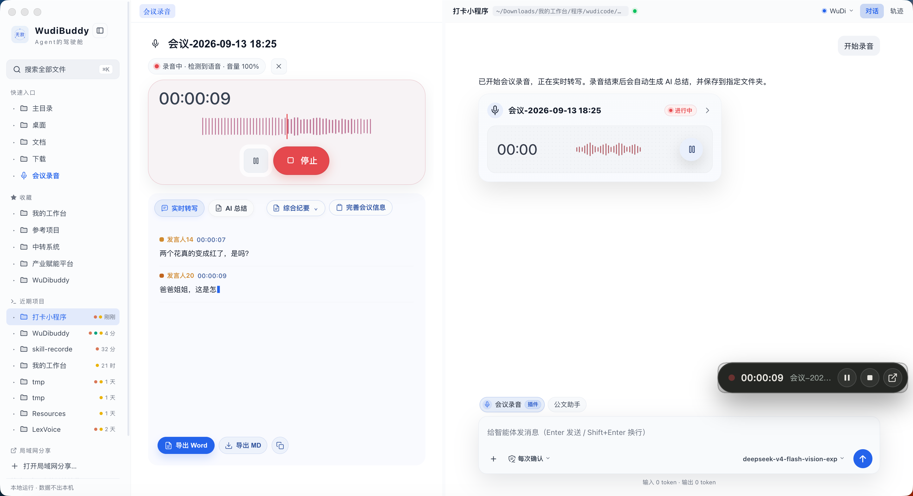

# 📦 无敌（Wudibuddy）

> *"AI 帮你一个下午起十个项目，然后它们就再也找不到了。无敌 帮你把它们找回来。"*

**Agent 的驾驶舱。** 左边浏览、预览、编辑本地文件，右边在真实终端或对话里指挥 Claude Code / Codex / WuDi 干活——它碰过哪些文件、改了哪一行，全程看得见，随时接手。

本仓库用于**分发安装包**（源码不公开）。macOS 与 Windows 安装包见下方 [下载安装](#下载安装)。

---

## 界面预览

  

  

  

---

## 它能做什么

### 一屏之内：文件、终端、对话

- **文件浏览 / 预览 / 编辑**——目录树、收藏、近期项目、全局模糊搜索（`内容:` 前缀切全文搜索）。内嵌预览 Markdown、代码高亮、图片、音视频、PDF、CSV/TSV，**Excel（xls/xlsx）、Word（docx/doc）、PPTX 也直接打开**，不用另开 Office。
- **内嵌真实终端**——node-pty + xterm.js（WebGL 渲染），跑 Claude Code / vim / htop 不花屏，中文宽字符、窗口缩放都正常。浏览器版同样有终端，能力一致。
- **对话式 Agent**——不想开终端就直接聊。**对话引擎可插拔**：内置 WuDi 引擎开箱即用（随包内置 Python 运行时，**不需要你本机装 Python**），也能一键切到本机已登录的 Claude Code / Codex，**按会话切换**、互不干扰。
- **指挥 Agent 干活**——从文件列表拖文件进终端当上下文、选中文字直接甩给终端、路径可点击跳转；终端里的 agent 还能反过来指挥兄弟终端窗口。

### Agent 干活，你全程看得见

- **文件实时亮起来**——agent 每写一个文件，对应卡片当场荡开涟漪、按改动频率呼吸，改了什么一目了然。
- **每回合自动存档**——影子 git 快照 + 工程快照，agent 大改之前留底，改坏了能整体回滚。不需要你手动 commit 才敢让它动手。
- **让 Agent 替你操作网页**——内置浏览器标签，agent 能读页面元素清单、点击、填表、翻页、截图；危险动作会先弹一张批准卡问你，你点了才执行。

### 顺手的那些

- **会议录音**（插件）——一边开会一边实时转写、自动区分发言人，结束后生成 AI 总结，一键导出 Word / Markdown。
- **定时任务**——cron / 固定时刻 / 固定间隔，到点自动开终端跑 agent 或命令。错过不补跑。
- **模型供应商**——给本机 Claude Code / Codex 一键切换 API 底座（对齐 CC Switch），也支持任意 OpenAI / Anthropic 兼容端点，可测速、可拉取模型列表。
- **微信遥控**——接上微信，手机发条消息就能使唤本机的 agent 干活，结果回你微信。
- **技能 / 插件体系**——能力以技能和插件形式挂载，面板里启停，随用随装。
- **本地优先**——零依赖后端，数据不出本机，离线完全可用。两套皮肤（档案 / 终端），中英双语。

## 下载安装

| 平台 | 安装包 | 说明 |
|---|---|---|
| **macOS（Apple Silicon）** | `Wudibuddy-1.0.0-arm64.dmg` | 拖进「应用程序」即可，M1/M2/M3/M4 原生。首次打开如被 Gatekeeper 拦 → 右键 → 打开（自签名未公证） |
| **macOS（Intel）** | `Wudibuddy-1.0.0-x64.dmg` | 拖进「应用程序」即可，Intel x64 原生。同上 |
| **Windows** | `Wudibuddy-1.0.0-Windows-x64.exe` | 双击安装（NSIS 安装包，可自选安装目录）。由 GitHub Actions 在真实 Windows 环境构建，node-pty 已原生编译 |

> 到 [Releases](https://github.com/waytouniverse/wudi/releases) 页下载对应平台的安装包。

**当前版本：1.0.0**

系统要求

- **macOS**：Apple Silicon (arm64) 或 Intel (x64)，macOS 12 或更新。
- **Windows**：64 位（x64），Windows 10 或更新。

## 许可

本软件采用[**专有许可**](LICENSE)，保留所有权利。安装包可免费下载，在你自己的设备上安装使用。

本软件建立在多个开源项目之上，**上游组件仍按其原有许可授权**，你依其取得的权利不因本协议而减损——详见随包分发的 `THIRD-PARTY-NOTICES.md`。

## 关于

**无敌** 由 [阿旬同学](https://ai.wudiyuzhou.top/) 搭建，建立在多个开源项目之上，并非完全从零打造。

> 把大模型从 PPT 搬进生产线。不做「聊天气泡式」AI，只做能直接算 ROI 的落地场景。

- **角色**：AI 产品研发框架师 · 企业场景应用创新专家 · 算法工程师 · 珠海青年夜校讲师
- **个人站点**：[ai.wudiyuzhou.top](https://ai.wudiyuzhou.top/) · GitHub [@waytouniverse](https://github.com/waytouniverse)
- **License**：[专有许可](LICENSE) · 保留所有权利

## 联系作者

<table align="center">
  <tr>
    <td align="center">
       
      <b>加我的微信</b>
    </td>
    <td align="center">
       
      <b>关注公众号</b>
    </td>
  </tr>
</table>

扫码添加微信，或关注公众号，获取更新与支持。

---

专有许可 · 保留所有权利 © [阿旬同学](https://github.com/waytouniverse)
 
Proprietary License · All rights reserved

