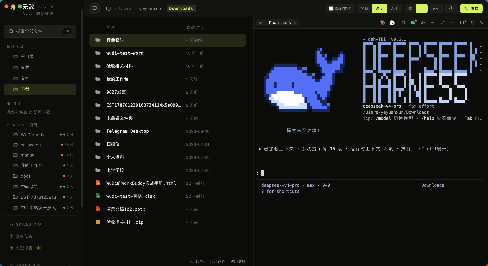
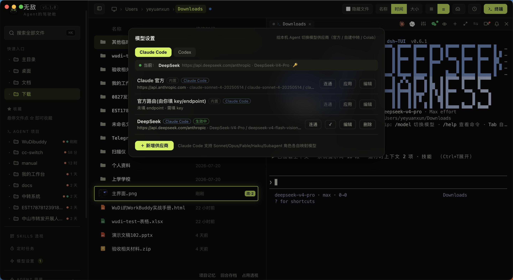

# 📦 无敌（Wudibuddy）

> *"AI 帮你一个下午起十个项目，然后它们就再也找不到了。无敌 帮你把它们找回来。"*

**无敌：Agent 的驾驶舱。** 一边浏览、预览、编辑本地文件，一边在内嵌真实终端里指挥 Claude Code / Codex 干活，看清它碰过的每个文件、改过的每一行，随时接手。

本仓库用于**分发安装包**（源码不开源）。macOS 与 Windows 两平台安装包见下方 [下载安装](#下载安装) / Release。

---

## 界面预览

  

  

---

## 它能做什么

- **文件浏览与预览**：目录树、全局模糊搜索（`内容:` 前缀切全文搜索）、Markdown/代码/图片/视频/PDF 内嵌预览，Excel / Word / PPTX 也能直接看。
- **内嵌真实终端**：node-pty + xterm.js（WebGL 渲染），跑 Claude Code / vim / htop 不花屏。
- **指挥 Agent**：从文件列表拖文件进终端当上下文、选中文字即甩给终端、路径可点击；终端里的 agent 还能指挥兄弟窗口。
- **看 Agent 改了什么**：agent 每写一个文件，对应卡片亮起来；会话回放、Git diff、变更收件箱。
- **定时任务**：cron / 固定时刻 / 固定间隔，到点自动开终端跑 agent。
- **模型供应商**：给本机 Claude Code / Codex 切换 API 底座（对齐 CC Switch）。
- **本地优先**：零依赖后端、数据不出本机、离线完全可用。

## 下载安装

| 平台 | 安装包 | 说明 |
|---|---|---|
| **macOS** | `Wudibuddy-1.1.0-arm64.dmg` | 拖进「应用程序」即可，Apple Silicon 原生。当前未签名未公证（macOS 26 ad-hoc 签名会破坏 Electron 框架加载链），首次打开如被 Gatekeeper 拦 → 右键 → 打开 |
| **Windows** | `Wudibuddy-1.1.0-Windows-x64.exe` | 双击安装（或便携版免安装）。由 GitHub Actions 在真实 Windows 环境构建，node-pty 已原生编译。⚠️ 处于内测阶段，请自行评估后使用 |

> 到 [Releases](https://github.com/waytouniverse/wudi/releases) 页下载对应平台的安装包。

系统要求

- **macOS**：Apple Silicon (arm64)，macOS 12 或更新。
- **Windows**：64 位（x64），Windows 10 或更新。

## 建在巨人肩膀上

无敌 的核心能力来自这些出色的开源项目，在此致谢：

| 项目 / Project | 用在哪 / Used for | License |
|---|---|---|
| [FanBox](https://github.com/alchaincyf/fanbox) | **本项目的起点。** 底层底座沿用了 FanBox 的骨架，在其上重写了界面与架构，并新增终端、文档预览、模型供应商、微信桥接等大量能力。它站在巨人的肩膀上，也已经走得比最初远很多。 **Where this project started.** The base layer rests on FanBox's skeleton; the UI and architecture were rewritten on top, with the terminal, document previews, model providers, WeChat bridge and more built up from there. Standing on a giant's shoulders, and a good deal further out. | MIT |
| [huashu-design](https://github.com/alchaincyf/huashu-design) | 界面设计辅助：皮肤方向探索、组件质感、反 AI slop 审查都出自它的工作流 UI design assistance — skin direction exploration, component polish and anti-AI-slop review | MIT |
| [Electron](https://www.electronjs.org/) | 桌面壳，让零依赖 Node 后端长出真实终端和原生能力 The desktop shell that gives a zero-dep Node backend a real terminal | MIT |
| [node-pty](https://github.com/microsoft/node-pty) | 伪终端，内嵌终端的「真 shell」来源 The pseudo-terminal behind the embedded "real shell" | MIT |
| [xterm.js](https://xtermjs.org/) | 终端渲染（WebGL GPU 加速、fit 自适应、CJK 宽字符） Terminal rendering (WebGL GPU accel, fit, CJK) | MIT |
| [Monaco Editor](https://microsoft.github.io/monaco-editor/) | 代码/JSON 编辑与 Git diff 视图，VS Code 同款内核 Code/JSON editing and Git diff view, the VS Code core | MIT |
| [Milkdown](https://milkdown.dev/)（Crepe） | Markdown 所见即所得编辑 Markdown WYSIWYG editing | MIT |
| [marked](https://marked.js.org/) | Markdown 预览渲染 Markdown preview rendering | MIT |
| [highlight.js](https://highlightjs.org/) | 代码语法高亮 Syntax highlighting | BSD-3-Clause |
| [esbuild](https://esbuild.github.io/) | 把 Milkdown 打成单文件本地 vendor，运行时保持 no-build Bundling Milkdown into a single local vendor, keeping runtime no-build | MIT |
| [electron-builder](https://www.electron.build/) | 打包各平台安装包 Packaging the installers | MIT |
| [Playwright](https://playwright.dev/) | 驱动 Electron 实拍截图 + UI 验证 Driving Electron for README screenshots + UI verification | Apache-2.0 |

所有前端依赖都 vendor 到本地（`public/vendor/`），「离线完全可用」的底气所在，也意味着上面每个项目的代码真实地跑在你机器上。谢谢它们。

## 关于

- **作者**：阿旬同学
- **License**: [MIT](LICENSE)

## 联系作者

<table align="center">
  <tr>
    <td align="center">
       
      <b>加我的微信</b>
    </td>
    <td align="center">
       
      <b>关注公众号</b>
    </td>
  </tr>
</table>

扫码添加微信，或关注公众号，获取更新与支持。

---

MIT License © [阿旬同学](https://github.com/waytouniverse)

